# How Voting Works in ElectionGuard

##  Quick Overview

  ElectionGuard is an end-to-end verifiable (E2EV) voting system using homomorphic encryption. Votes stay encrypted and secret, yet voters
  can verify their ballots were counted and third parties can independently audit the entire election.

  ---
##  The Voting Process

  1. Pre-Election Setup (Key Ceremony)

  - Guardians (trusted individuals) each generate election key pairs
  - Their public keys combine to create a Joint Election Key that encrypts all ballots
  - Private keys are shared among guardians (k-of-n threshold), so any k guardians can decrypt results
  - Encryption devices receive the public key and election manifest (contests, candidates, ballot styles)

  2. Voter Makes Selections

  - Voter marks ballot with their choices (via scanner or ballot-marking device)
  - Creates a PlaintextBallot with selections (e.g., [1,0,1,0,1] for chosen options)

  3. Ballot Encryption (Core Innovation)

  Using ElGamal homomorphic encryption:
  - Each selection encrypted individually: C_i = E(selection_i)
  - Zero-knowledge proofs generated proving:
    - Each selection is 0 or 1 (no invalid values)
    - Sum of selections per contest equals the selection limit (no overvotes)
  - Creates CiphertextBallot with encrypted choices + cryptographic proofs
  - Generates unique verification code (e.g., COOK 7HMCG NOTION 9329D...)

  4. Cast or Challenge Decision

  CAST Path:
  - Voter accepts ballot → marked as CAST
  - Included in election tally
  - Voter keeps verification code

  CHALLENGE (Spoil) Path:
  - Voter challenges ballot → marked as SPOILED
  - Immediately decrypted to show voter their encrypted selections were correct
  - NOT counted in tally
  - Voter must start over with new ballot
  - Security benefit: Random sampling of challenges proves system integrity

  5. Post-Election Tally

  Homomorphic Aggregation:
  All cast ballots multiplied together:
  E(ballot₁) × E(ballot₂) × ... × E(ballotₙ) = E(total_votes)
  Results in encrypted tally WITHOUT decrypting individual ballots

  Tally Ceremony:
  - Guardians meet to decrypt the aggregated tally (minimum k required)
  - Each provides partial decryption with cryptographic proof
  - Combined to reveal PlaintextTally (final vote counts)

  6. Verification (The Magic)

  Voters Can Verify:
  - Search for their verification code in published election record
  - Confirm ballot was included and counted
  - Challenge ballots show decrypted contents proving correct encryption

  Anyone Can Verify:
  - Published election record contains:
    - All encrypted cast ballots with proofs
    - Encrypted + decrypted tally with decryption proofs
    - All spoiled ballots with decryptions
  - Independent verifiers can mathematically confirm:
    - All ballots properly encrypted
    - Tally correctly aggregated
    - Decryption performed correctly

  ---
  Key Security Properties

  1. Privacy: Ballots stay encrypted; individual votes never revealed
  2. Cast as Intended: Challenge ballots prove correct encryption
  3. Counted as Cast: Public proofs verify correct tallying
  4. Auditability: All operations produce cryptographic proofs
  5. Resilience: System works even if some guardians unavailable

  ---
  Key Files in Codebase

  The project appears to be documentation and tools for ElectionGuard, with key resources in:
  - Election manifests defining ballot structure
  - Guardian and key ceremony documentation
  - Verification tools and examples
  - Integration guides for voting device vendors

# visualizations to explain the ElectionGuard voting process.

  1. Simple ASCII Flow Diagram

  PRE-ELECTION
  -----------
  Guardians → Generate Keys → Combine → Joint Election Key (K)
                                              |
                                              v
  Election Manifest → Device Setup ← Joint Public Key
  (contests, candidates)      |
                             |
                             v

  VOTING DAY
  ----------
  Voter Selections → Plaintext Ballot [1,0,1,0,1]
                            |
                            v
                    ElGamal Encryption
                            |
                            v
                Ciphertext Ballot + Proofs
                            |
                            v
                Verification Code: COOK 7HMCG...
                            |
                      /------------\
                     /              \
                CAST                CHALLENGE (Spoil)
                  |                      |
                  v                      v
           Store Encrypted        Decrypt & Show Voter
           Keep Code             Verify → Start Over
                  |
                  v

  POST-ELECTION
  -------------
  All Cast Ballots → Homomorphic Sum → Encrypted Tally
                                             |
                                             v
                                    Tally Ceremony
                                    (k Guardians)
                                             |
                                             v
                                     Plaintext Tally
                                             |
                                             v
                                    Publish Everything
                                             |
                      /----------------------+----------------------\
                     /                       |                       \
                    v                        v                        v
            Voters Verify Code      Third Parties Verify      Audit Entire Election
            (cast as intended)      (counted as cast)         (mathematical proofs)

  2. Tree View of ElectionGuard Components

  ElectionGuard Voting System
  │
  ├── PRE-ELECTION: Key Generation Ceremony
  │   ├── Guardians (n trustees)
  │   │   ├── Guardian 1: Private Key P1 + Public Key K1
  │   │   ├── Guardian 2: Private Key P2 + Public Key K2
  │   │   └── Guardian n: Private Key Pn + Public Key Kn
  │   ├── Joint Election Key: K = K1 × K2 × ... × Kn
  │   ├── Threshold: k-of-n (any k guardians can decrypt)
  │   └── Backup Shares (encrypted portions of private keys)
  │
  ├── ELECTION DEFINITION: Manifest
  │   ├── Geopolitical Units
  │   │   ├── County
  │   │   ├── Township
  │   │   └── School District
  │   ├── Contests
  │   │   ├── Contest 1: Supreme Court Justice (select 2)
  │   │   │   ├── Candidate A
  │   │   │   ├── Candidate B
  │   │   │   ├── Candidate C
  │   │   │   └── Write-in
  │   │   └── Contest 2: Ballot Question (select 1)
  │   │       ├── Yes
  │   │       └── No
  │   └── Ballot Styles (contest combinations per location)
  │       ├── Style 1: County-wide contests
  │       └── Style 2: County + Township contests
  │
  ├── VOTING PROCESS: Ballot Creation
  │   ├── Voter Input
  │   │   └── Selections: [1,0,1,0,1] per contest
  │   ├── PlaintextBallot
  │   │   ├── Ballot ID
  │   │   ├── Ballot Style
  │   │   └── Selection Arrays
  │   ├── Encryption Process
  │   │   ├── Generate random nonce
  │   │   ├── ElGamal Encrypt each selection
  │   │   ├── Create Zero-Knowledge Proofs
  │   │   │   ├── Chaum-Pedersen (0 or 1 proof)
  │   │   │   └── Range Proof (sum = limit)
  │   │   └── Ballot Chaining (hash previous)
  │   ├── CiphertextBallot
  │   │   ├── Encrypted Selections: [C1, C2, C3, ...]
  │   │   ├── Correctness Proofs
  │   │   ├── Aggregate per Contest
  │   │   └── Timestamp + Device ID
  │   └── Verification Code
  │       └── Hash → Human-readable: "COOK 7HMCG NOTION..."
  │
  ├── BALLOT SUBMISSION: Cast or Challenge
  │   ├── CAST Branch
  │   │   ├── Status: CAST
  │   │   ├── Store: submitted_ballots/
  │   │   ├── Include in Tally: YES
  │   │   └── Voter Takes: Verification Code
  │   └── CHALLENGE (Spoil) Branch
  │       ├── Status: SPOILED
  │       ├── Immediate Decryption
  │       ├── Show Voter: Plaintext Selections
  │       ├── Store: spoiled_ballots/
  │       ├── Include in Tally: NO
  │       └── Voter Action: Start New Ballot
  │
  ├── POST-ELECTION: Tally Process
  │   ├── Encrypted Tally Aggregation
  │   │   ├── Homomorphic Multiplication
  │   │   ├── E(ballot1) × E(ballot2) × ... × E(ballotn)
  │   │   └── Result: E(total_votes_per_option)
  │   ├── Tally Ceremony
  │   │   ├── Minimum k Guardians Present
  │   │   ├── Each Guardian: Partial Decryption + Proof
  │   │   ├── Missing Guardians: Use Backup Shares
  │   │   └── Combine: Lagrange Interpolation
  │   ├── PlaintextTally
  │   │   ├── Contest 1: Candidate A = 312 votes
  │   │   ├── Contest 1: Candidate B = 289 votes
  │   │   └── Contest 2: Yes = 445 votes
  │   └── Decryption Proofs
  │       └── Prove guardians decrypted correctly
  │
  ├── PUBLISHED ELECTION RECORD
  │   ├── manifest.json (election definition)
  │   ├── context.json (joint public key, parameters)
  │   ├── constants.json (cryptographic constants)
  │   ├── encrypted_tally.json (aggregated encrypted votes)
  │   ├── tally.json (final decrypted results)
  │   ├── submitted_ballots/
  │   │   ├── ballot-001.json (encrypted + proofs)
  │   │   ├── ballot-002.json
  │   │   └── ballot-nnn.json
  │   ├── spoiled_ballots/
  │   │   ├── spoiled-001.json (decrypted + proofs)
  │   │   └── spoiled-nnn.json
  │   ├── guardians/
  │   │   ├── guardian-1.json (public commitments)
  │   │   └── guardian-n.json
  │   └── encryption_devices/
  │       ├── device-001.json (metadata)
  │       └── device-nnn.json
  │
  └── VERIFICATION LAYER
      ├── Individual Voter Verification
      │   ├── Input: Verification Code
      │   ├── Search: Published Election Record
      │   ├── Confirm: Ballot Present in CAST list
      │   └── View: Metadata (device, timestamp, location)
      ├── Challenge Ballot Verification
      │   ├── Input: Spoiled Ballot Code
      │   ├── View: Decrypted Contents
      │   └── Confirm: Encryption Was Correct
      └── Independent Third-Party Verification
          ├── Verify Each Ballot
          │   ├── Check Zero-Knowledge Proofs
          │   └── Validate Selection Limits
          ├── Verify Tally Aggregation
          │   └── Recompute Homomorphic Sum
          ├── Verify Decryption
          │   └── Check Guardian Proofs
          └── Report
              ├── Pass: Election Mathematically Verified
              └── Fail: Identify Specific Discrepancies

  3. Mermaid E2E Sequence Diagram

```mermaid
  sequenceDiagram
      actor EA as Election Admin
      actor G as Guardians (n)
      actor V as Voter
      participant D as Voting Device
      participant ES as Election System
      actor Ver as Verifiers

      Note over EA,G: PRE-ELECTION PHASE
      EA->>EA: Create Election Manifest
      Note right of EA: Define contests,<br/>candidates, styles

      EA->>G: Initiate Key Ceremony
      loop Each Guardian
          G->>G: Generate Key Pair (Private, Public)
          G->>G: Create Backup Shares
      end
      G->>G: Combine Public Keys
      G-->>ES: Joint Election Key (K)
      Note right of G: K = K1 × K2 × ... × Kn

      EA->>D: Load Manifest + Public Key K
      D->>D: Device Setup Complete

      Note over V,ES: VOTING PHASE
      V->>D: Check In (get ballot style)
      V->>D: Make Selections
      Note right of V: Contest 1: [1,0,1]<br/>Contest 2: [1,0]

      D->>D: Create PlaintextBallot
      D->>D: Encrypt with Key K
      Note right of D: ElGamal Encryption<br/>+ Zero-Knowledge Proofs

      D->>D: Generate CiphertextBallot
      D->>D: Compute Verification Code
      Note right of D: Hash → "COOK 7HMCG..."

      D-->>V: Show Verification Code
      D-->>V: Display Ballot Summary

      alt Voter Casts Ballot
          V->>D: CAST Ballot
          D->>ES: Store as CAST
          Note right of ES: submitted_ballots/<br/>ballot-001.json
          D-->>V: Print Code Receipt
          V->>V: Keep Verification Code

      else Voter Challenges Ballot
          V->>D: CHALLENGE (Spoil) Ballot
          D->>ES: Request Decryption
          ES->>G: Partial Decrypt (quorum k)
          G-->>ES: Decrypted Ballot + Proofs
          ES->>D: Return Plaintext
          D-->>V: Show Decrypted Selections
          V->>V: Verify Correctness
          ES->>ES: Store as SPOILED
          Note right of ES: spoiled_ballots/<br/>spoiled-001.json
          V->>D: Start New Ballot
      end

      Note over EA,Ver: POST-ELECTION PHASE
      EA->>ES: Close Voting
      ES->>ES: Aggregate All CAST Ballots
      Note right of ES: Homomorphic Sum:<br/>E(b1) × E(b2) × ... × E(bn)

      ES->>ES: Create Encrypted Tally

      EA->>G: Initiate Tally Ceremony
      loop Each Guardian (minimum k)
          G->>G: Partial Decrypt Tally
          G->>G: Generate Decryption Proof
          G-->>ES: Partial Decryption + Proof
      end

      alt Missing Guardians
          G->>G: Use Backup Shares
          Note right of G: Lagrange<br/>Interpolation
      end

      ES->>ES: Combine Partial Decryptions
      ES->>ES: Generate PlaintextTally
      Note right of ES: Candidate A: 312<br/>Candidate B: 289

      EA->>ES: Publish Election Record
      ES-->>Ver: Complete Record Available
      Note right of ES: All ballots, proofs,<br/>tally, guardians

      Note over V,Ver: VERIFICATION PHASE
      V->>Ver: Search My Code
      Ver->>ES: Query Verification Code
      ES-->>Ver: Ballot Metadata
      Ver-->>V: ✓ Ballot Found in CAST
      Note right of V: Confirms<br/>Cast as Intended

      Ver->>ES: Download Election Record
      loop For Each Ballot
          Ver->>Ver: Verify Zero-Knowledge Proofs
          Ver->>Ver: Check Selection Limits
      end

      Ver->>Ver: Verify Tally Aggregation
      Note right of Ver: Recompute<br/>Homomorphic Sum

      Ver->>Ver: Verify Guardian Decryptions
      Note right of Ver: Check all<br/>decryption proofs

      alt Verification Pass
          Ver-->>Ver: ✓ Election Verified
          Note right of Ver: Counted as Cast
      else Verification Fail
          Ver-->>EA: ✗ Report Discrepancies
      end

```

  ---
  Key Takeaways from the Diagrams

  ASCII Flow: Shows the linear progression from setup → voting → verification

  Tree View: Shows the hierarchical structure of all components and data

  Mermaid Sequence: Shows the interactions between actors (voters, guardians, devices, verifiers) over time

  The critical innovation is the homomorphic encryption that allows:
  - Adding encrypted votes without decrypting them: E(a) × E(b) = E(a+b)
  - Mathematical proofs at every step
  - Complete transparency without sacrificing voter privacy

