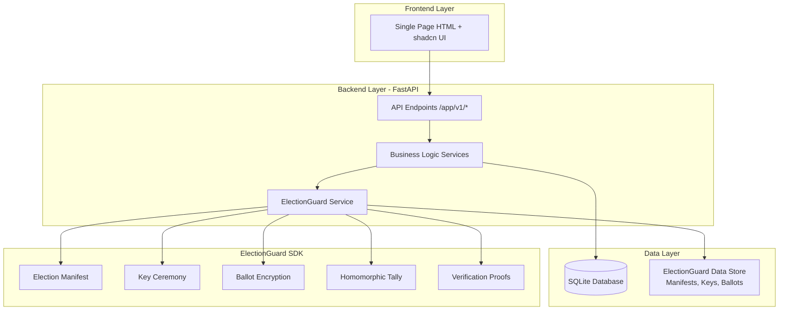
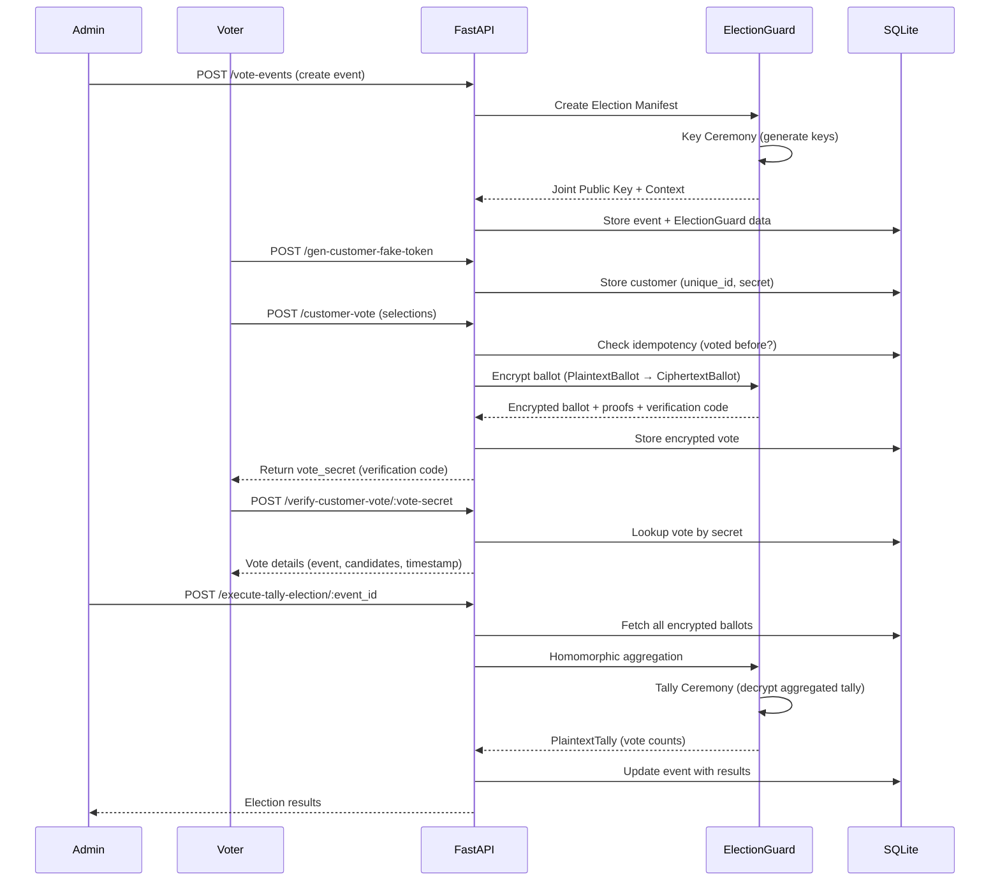
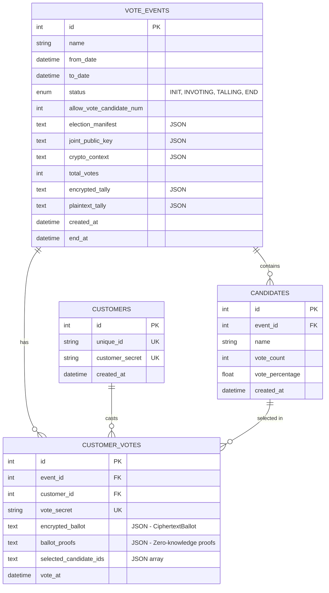

# ElectionGuard Voting Demo - Requirements Specification

**Version:** 2.0 (MVP)
**Last Updated:** 2025-11-13
**Status:** Draft

---

## Executive Summary

### Goal
Build a web-based demonstration application that showcases ElectionGuard's end-to-end verifiable voting technology. The system allows users to create voting events, cast encrypted ballots, verify their votes, and see tamper-proof tally results.

### Key Features
- **Event Management**: Create and manage voting events with multiple candidates
- **Secure Voting**: Encrypt votes using ElectionGuard's homomorphic encryption
- **Vote Verification**: Voters can verify their ballots were counted correctly
- **Transparent Tallying**: Cryptographically verifiable election results
- **Audit Trail**: Comprehensive logging of all ElectionGuard operations

### Technology Stack
- **Backend**: Python FastAPI (built with `uv` package manager)
- **Database**: SQLite (MVP - simple, file-based)
- **Encryption**: ElectionGuard SDK ([electionguard-python](https://github.com/Election-Tech-Initiative/electionguard))
- **Frontend**: Single HTML page with shadcn UI components (CDN)

---

## System Architecture

### High-Level Architecture



### Data Flow - Voting Process



---

## User Flows and Scenarios

### Flow 1: Administrator Creates Voting Event

**Actor**: Election Administrator

**Steps**:
1. Admin opens the web application
2. Navigates to "Create Event" section
3. Fills in event form:
   - Event name: "2024 Student Council Election"
   - From date: "2024-12-01 09:00"
   - To date: "2024-12-01 17:00"
   - Candidates: ["Alice Johnson", "Bob Smith", "Carol Williams"]
   - Allow vote for: 1 candidate
4. Clicks "Create Event" button
5. System creates ElectionGuard manifest and performs key ceremony
6. Event appears in UI with status "INVOTING"

**Success Criteria**:
- Event is created in database with status INVOTING
- ElectionGuard manifest is generated with 3 candidates
- Joint public key is created and stored
- Event details are displayed on the page

---

### Flow 2: Voter Registration and Casting Vote

**Actor**: Voter

**Steps**:
1. Voter opens the web application
2. In "Customer Vote" section, enters name: "John Doe"
3. Clicks "Create Customer" button
4. System generates unique customer secret (UUID)
5. Customer appears in "Customers" table
6. Voter selects their name from customer dropdown
7. Selects candidate "Alice Johnson" from candidates dropdown
8. Clicks "Vote" button
9. System encrypts ballot using ElectionGuard
10. Vote is recorded, verification code displayed
11. Vote appears in "Customer Votes" table with "Verify" button

**Success Criteria**:
- Customer created with unique secret token
- Ballot is encrypted using ElectionGuard (CiphertextBallot)
- Zero-knowledge proofs are generated
- Vote secret (verification code) is returned
- Vote is stored in database linked to customer and event
- Customer cannot vote twice (idempotency check)

---

### Flow 3: Vote Verification

**Actor**: Voter

**Steps**:
1. Voter finds their vote in "Customer Votes" table
2. Clicks "Verify" button next to their vote
3. System shows vote details:
   - Event name
   - Event status
   - Customer name
   - Selected candidates
   - Vote timestamp
4. Voter confirms their selections match

**Success Criteria**:
- System retrieves vote by vote_secret
- All vote details are displayed correctly
- Verification confirms ballot integrity

---

### Flow 4: Tally Execution and Results

**Actor**: Election Administrator

**Steps**:
1. Admin clicks "TALLY ELECTION" button
2. System aggregates all encrypted ballots homomorphically
3. ElectionGuard performs tally ceremony (decryption)
4. Event status changes to "TALLING" then "END"
5. Results displayed showing:
   - Winner with vote count and percentage
   - Statistics table with all candidates sorted by votes
6. Admin can click "Refresh" to reload results

**Success Criteria**:
- All cast ballots are aggregated without decrypting individual votes
- Tally ceremony produces accurate vote counts
- Event status updates to END
- Winner is correctly identified
- Vote statistics show correct counts and percentages
- Total votes match number of customer votes

---

## Backend API Specifications

### Base URL
```
/app/v1
```

### API 1: Create Vote Event

**Endpoint**: `POST /app/v1/vote-events`

**Description**: Creates a new voting event with candidates and initializes ElectionGuard components.

**Request Body**:
```json
{
  "name": "2024 Student Council Election",
  "from_date": "2024-12-01T09:00:00Z",
  "to_date": "2024-12-01T17:00:00Z",
  "candidate_names": ["Alice Johnson", "Bob Smith", "Carol Williams"],
  "allow_vote_candidate_num": 1
}
```

**Validation Rules**:
- `name`: Required, max 255 characters
- `from_date`: Required, must be valid ISO datetime
- `to_date`: Required, must be after `from_date`
- `candidate_names`: Required, array of unique strings (2-10 candidates)
- `allow_vote_candidate_num`: Required, integer (1 ≤ n ≤ number of candidates)

**Response** (201 Created):
```json
{
  "event_id": 1,
  "name": "2024 Student Council Election",
  "from": "2024-12-01T09:00:00Z",
  "to": "2024-12-01T17:00:00Z",
  "status": "INVOTING",
  "allow_vote_candidate_num": 1,
  "candidates": [
    {"id": 1, "name": "Alice Johnson"},
    {"id": 2, "name": "Bob Smith"},
    {"id": 3, "name": "Carol Williams"}
  ]
}
```

**ElectionGuard Operations**:
1. Create Election Manifest with candidates as contest selections
2. Perform Key Ceremony (simplified for MVP - single guardian)
3. Generate Joint Election Public Key
4. Store manifest, public key, and crypto context

**Logging**:
```json
{
  "operation": "create_vote_event",
  "event_id": 1,
  "details": {
    "manifest_created": true,
    "key_ceremony_completed": true,
    "guardian_count": 1,
    "candidate_count": 3
  }
}
```

---

### API 2: Generate Customer Token

**Endpoint**: `POST /app/v1/gen-customer-fake-token`

**Description**: Registers a voter and generates a unique authentication token (simplified for MVP).

**Request Body**:
```json
{
  "unique_id": "john.doe@example.com"
}
```

**Validation Rules**:
- `unique_id`: Required, unique string (max 255 characters)

**Response** (201 Created):
```json
{
  "customer_id": 1,
  "unique_id": "john.doe@example.com",
  "customer_secret": "a1b2c3d4-e5f6-7890-abcd-ef1234567890"
}
```

**Error Response** (400 Bad Request):
```json
{
  "error": "DUPLICATE_CUSTOMER",
  "message": "Customer with this unique_id already exists"
}
```

**Business Logic**:
- Generate UUID as `customer_secret`
- Store customer with unique constraint on `unique_id`

---

### API 3: Cast Customer Vote

**Endpoint**: `POST /app/v1/customer-vote`

**Description**: Records an encrypted vote for a customer using ElectionGuard encryption.

**Request Body**:
```json
{
  "customer_secret": "a1b2c3d4-e5f6-7890-abcd-ef1234567890",
  "vote_event_id": 1,
  "selected_candidates": [
    {"id": 1, "name": "Alice Johnson"}
  ]
}
```

**Validation Rules**:
1. **Authentication**: `customer_secret` must exist and be valid
2. **Event Validation**:
   - Event must exist
   - Event status must be "INVOTING"
   - Current time must be between `from_date` and `to_date`
3. **Candidate Validation**:
   - All selected candidate IDs must belong to the event
   - Number of selections must equal `allow_vote_candidate_num`
4. **Idempotency**: Customer can only vote once per event

**Response** (201 Created):
```json
{
  "vote_secret": "COOK-7HMCG-NOTION-9329D",
  "event_id": 1,
  "event_name": "2024 Student Council Election",
  "customer_id": 1,
  "selected_candidates": [
    {"id": 1, "name": "Alice Johnson"}
  ],
  "vote_at": "2024-12-01T10:30:00Z"
}
```

**Error Responses**:

```json
// 401 Unauthorized
{
  "error": "INVALID_CUSTOMER_SECRET",
  "message": "Customer not found or invalid secret"
}

// 400 Bad Request - Already voted
{
  "error": "ALREADY_VOTED",
  "message": "Customer has already voted in this event"
}

// 400 Bad Request - Wrong number of selections
{
  "error": "INVALID_SELECTION_COUNT",
  "message": "Must select exactly 1 candidate(s)"
}

// 400 Bad Request - Event not in voting period
{
  "error": "EVENT_NOT_ACTIVE",
  "message": "Event is not currently accepting votes (status: END or outside date range)"
}
```

**ElectionGuard Operations**:
1. Create PlaintextBallot from customer selections (1 for selected, 0 for not selected)
2. Encrypt ballot using Joint Election Public Key → CiphertextBallot
3. Generate Zero-Knowledge Proofs (Chaum-Pedersen proofs)
4. Generate verification code (vote_secret) from ballot hash
5. Store encrypted ballot and proofs

**Logging**:
```json
{
  "operation": "cast_vote",
  "event_id": 1,
  "customer_id": 1,
  "details": {
    "ballot_encrypted": true,
    "proofs_generated": true,
    "verification_code": "COOK-7HMCG-NOTION-9329D",
    "selection_count": 1
  }
}
```

---

### API 4: Verify Customer Vote

**Endpoint**: `POST /app/v1/verify-customer-vote/:vote_secret`

**Description**: Allows a voter to verify their vote was recorded correctly using their verification code.

**Path Parameter**:
- `vote_secret`: The verification code returned when vote was cast

**Request Body**: None

**Response** (200 OK):
```json
{
  "event_id": 1,
  "event_name": "2024 Student Council Election",
  "event_status": "INVOTING",
  "from": "2024-12-01T09:00:00Z",
  "to": "2024-12-01T17:00:00Z",
  "customer_name": "john.doe@example.com",
  "vote_candidates": [
    {"id": 1, "name": "Alice Johnson"}
  ],
  "vote_event": {
    "name": "2024 Student Council Election",
    "id": 1,
    "from": "2024-12-01T09:00:00Z",
    "to": "2024-12-01T17:00:00Z"
  },
  "vote_at": "2024-12-01T10:30:00Z"
}
```

**Error Response** (404 Not Found):
```json
{
  "error": "VOTE_NOT_FOUND",
  "message": "No vote found with this verification code"
}
```

**Business Logic**:
- Lookup vote by vote_secret
- Join with event and customer data
- Return decrypted metadata (NOT the encrypted ballot itself)

**Note**: This does NOT decrypt the actual ballot (which stays encrypted forever). It only shows the selections the customer made, which were stored alongside the encrypted ballot.

---

### API 5: Execute Tally Election

**Endpoint**: `POST /app/v1/execute-tally-election/:event_id`

**Description**: Aggregates all encrypted ballots and performs ElectionGuard tally ceremony to decrypt results.

**Path Parameter**:
- `event_id`: The voting event ID

**Request Body**: None

**Response** (200 OK):
```json
{
  "event": {
    "name": "2024 Student Council Election",
    "id": 1,
    "status": "END",
    "from": "2024-12-01T09:00:00Z",
    "to": "2024-12-01T17:00:00Z",
    "end_at": "2024-12-01T18:00:00Z",
    "allow_vote_candidate_num": 1,
    "candidates": [
      {"name": "Alice Johnson", "id": 1},
      {"name": "Bob Smith", "id": 2},
      {"name": "Carol Williams", "id": 3}
    ],
    "total_votes": 150,
    "vote_statistic": [
      {
        "candidate_name": "Alice Johnson",
        "candidate_id": 1,
        "vote_num": 75,
        "percent_vote": 50.0
      },
      {
        "candidate_name": "Bob Smith",
        "candidate_id": 2,
        "vote_num": 45,
        "percent_vote": 30.0
      },
      {
        "candidate_name": "Carol Williams",
        "candidate_id": 3,
        "vote_num": 30,
        "percent_vote": 20.0
      }
    ],
    "winner": {
      "candidate_name": "Alice Johnson",
      "candidate_id": 1,
      "vote_num": 75,
      "percent_vote": 50.0
    }
  }
}
```

**Error Responses**:
```json
// 404 Not Found
{
  "error": "EVENT_NOT_FOUND",
  "message": "Event not found"
}

// 400 Bad Request
{
  "error": "NO_VOTES_TO_TALLY",
  "message": "Event has no votes to tally"
}
```

**ElectionGuard Operations**:
1. Update event status to "TALLING"
2. Fetch all encrypted ballots for the event
3. Perform homomorphic aggregation: E(ballot₁) × E(ballot₂) × ... × E(ballotₙ) = E(total)
4. Perform Tally Ceremony:
   - Guardians provide partial decryptions
   - Combine partial decryptions → PlaintextTally
5. Extract vote counts per candidate
6. Calculate percentages
7. Determine winner (highest vote count)
8. Update event status to "END"
9. Store encrypted_tally and plaintext_tally

**Logging**:
```json
{
  "operation": "execute_tally",
  "event_id": 1,
  "details": {
    "total_ballots": 150,
    "aggregation_completed": true,
    "tally_ceremony_completed": true,
    "winner_id": 1,
    "winner_votes": 75
  }
}
```

---

### API 6: Get Vote Event Results

**Endpoint**: `GET /app/v1/vote_events/:event_id`

**Description**: Retrieves current event details and results (if tallied).

**Path Parameter**:
- `event_id`: The voting event ID

**Request Body**: None

**Response** (200 OK):
Same as API 5 response (execute-tally-election)

**Error Response** (404 Not Found):
```json
{
  "error": "EVENT_NOT_FOUND",
  "message": "Event not found"
}
```

**Business Logic**:
- If event status is "END", return full results with winner and statistics
- If event status is "INVOTING" or "INIT", return event details without results
- If event status is "TALLING", return event with indication that tallying is in progress

---

## Database Design

### Schema Overview



### Table Descriptions

#### `vote_events`
Stores voting events with ElectionGuard cryptographic materials.

**Indexes**:
- Primary key on `id`
- Index on `status` for filtering active events

**Constraints**:
- `to_date` > `from_date`
- `allow_vote_candidate_num` > 0

---

#### `candidates`
Stores candidates for each voting event.

**Indexes**:
- Primary key on `id`
- Foreign key on `event_id` → `vote_events(id)` with CASCADE delete

**Constraints**:
- Unique(`event_id`, `name`) - no duplicate candidate names in same event

---

#### `customers`
Stores registered voters (simplified authentication for MVP).

**Indexes**:
- Primary key on `id`
- Unique index on `unique_id`
- Unique index on `customer_secret`

---

#### `customer_votes`
Stores encrypted ballots and vote records.

**Indexes**:
- Primary key on `id`
- Foreign key on `event_id` → `vote_events(id)`
- Foreign key on `customer_id` → `customers(id)`
- Unique index on `vote_secret` (verification code lookup)
- Unique index on (`event_id`, `customer_id`) - ensures one vote per customer per event

---

## Frontend Specifications

### Technology
- **Single HTML file** with embedded JavaScript
- **CSS Framework**: Load shadcn UI components via CDN (or Tailwind CSS)
- **HTTP Client**: Fetch API for backend calls

### Layout Structure

```
┌─────────────────────────────────────────────────────────┐
│              ElectionGuard Voting Demo                  │
├─────────────────────────────────────────────────────────┤
│                                                          │
│  [1] CREATE EVENT SECTION                               │
│  ┌──────────────────────────────────────────────────┐  │
│  │ Event Name: [________________]                    │  │
│  │ From Date:  [________________]                    │  │
│  │ To Date:    [________________]                    │  │
│  │ Candidates: [________________] [Add Candidate]    │  │
│  │             - Alice Johnson    [Remove]           │  │
│  │             - Bob Smith        [Remove]           │  │
│  │ Allow Vote: [1] candidates                        │  │
│  │             [Create Event Button]                 │  │
│  └──────────────────────────────────────────────────┘  │
│                                                          │
│  Event Details: 2024 Student Council Election           │
│  Status: INVOTING | From: 12/01 09:00 | To: 12/01 17:00│
│                                                          │
├──────────────────────────┬──────────────────────────────┤
│                          │                              │
│ [2] CUSTOMER VOTE        │ [3] VOTE RESULTS             │
│ (LEFT COLUMN)            │ (RIGHT COLUMN)               │
│                          │                              │
│ 2.1 Create Customer      │                              │
│ ┌──────────────────────┐ │  [Tally Election Button]    │
│ │ Name: [__________]   │ │  [Refresh Results Button]   │
│ │      [Create]        │ │                              │
│ └──────────────────────┘ │  Winner                      │
│                          │  ┌────────────────────────┐  │
│ Customers Table:         │  │ Alice Johnson          │  │
│ Name           | Secret  │  │ 75 votes (50%)         │  │
│ john.doe@...   | a1b2... │  └────────────────────────┘  │
│ jane.smith@... | f3e4... │                              │
│                          │  Vote Statistics             │
│ 2.2 Cast Vote            │  Candidate     | Votes | %   │
│ ┌──────────────────────┐ │  Alice Johnson |  75  | 50% │
│ │ Customer: [Select ▼] │ │  Bob Smith     |  45  | 30% │
│ │ Candidates: [Select] │ │  Carol Williams|  30  | 20% │
│ │           [Vote]     │ │                              │
│ └──────────────────────┘ │                              │
│                          │                              │
│ Customer Votes Table:    │                              │
│ Customer | Candidates    │                              │
│ john.doe | Alice Johnson │                              │
│          | [Verify]      │                              │
│ jane.smi | Bob Smith     │                              │
│          | [Verify]      │                              │
│                          │                              │
└──────────────────────────┴──────────────────────────────┘
```

### Section Descriptions

#### Section 1: Create Event
- Form with inputs for event details
- Dynamic candidate list (add/remove)
- "Create Event" button calls `POST /app/v1/vote-events`
- Display created event details below form

#### Section 2.1: Create Customer
- Input field for customer unique_id (name/email)
- "Create" button calls `POST /app/v1/gen-customer-fake-token`
- Table displays all customers with their secrets (for MVP testing)

#### Section 2.2: Cast Vote
- Dropdown to select customer from customers table
- Multi-select dropdown for candidates (respects `allow_vote_candidate_num`)
- "Vote" button calls `POST /app/v1/customer-vote`
- After vote, add row to "Customer Votes" table

#### Customer Votes Table
- Shows all votes cast
- Each row has "Verify" button
- Clicking "Verify" calls `POST /app/v1/verify-customer-vote/:vote_secret`
- Display vote details in modal/alert

#### Section 3: Vote Results
- "Tally Election" button calls `POST /app/v1/execute-tally-election/:event_id`
- "Refresh Results" button calls `GET /app/v1/vote_events/:event_id`
- Winner section highlights winning candidate
- Statistics table shows all candidates sorted by vote count (descending)

### UI/UX Requirements
- **Responsive**: Works on desktop and tablet
- **Form Validation**: Client-side validation before API calls
- **Error Handling**: Display error messages from API responses
- **Loading States**: Show spinners during API calls
- **Success Feedback**: Toast notifications for successful actions

---

## Success Criteria & Testing Plan (MVP)

### MVP Success Criteria

#### Functional Requirements
✅ **FR1**: Admin can create voting event with 2-10 candidates
✅ **FR2**: System generates ElectionGuard manifest and keys for each event
✅ **FR3**: Customers can register with unique identifier
✅ **FR4**: Customers can cast encrypted votes during event period
✅ **FR5**: System enforces one vote per customer per event (idempotency)
✅ **FR6**: System validates candidate selections match event rules
✅ **FR7**: Voters receive verification code after voting
✅ **FR8**: Voters can verify their vote using verification code
✅ **FR9**: Admin can trigger tally ceremony
✅ **FR10**: System displays accurate results with winner

#### Non-Functional Requirements
✅ **NFR1**: All votes encrypted using ElectionGuard homomorphic encryption
✅ **NFR2**: Zero-knowledge proofs generated for all ballots
✅ **NFR3**: Comprehensive logging for all ElectionGuard operations
✅ **NFR4**: API response time < 2 seconds (for < 1000 votes)
✅ **NFR5**: Database properly handles concurrent votes

### Test Scenarios

#### Test 1: Complete Happy Path
1. Create event "Mock Election" with 3 candidates
2. Register 10 customers
3. Each customer casts vote
4. Verify all 10 votes using verification codes
5. Execute tally
6. Verify results show correct vote counts
7. Check logs for complete audit trail

**Expected**: All operations succeed, winner correctly identified, logs complete

---

#### Test 2: Idempotency Protection
1. Create event and register customer
2. Customer casts vote for Candidate A
3. Attempt to vote again for Candidate B

**Expected**: Second vote rejected with error "ALREADY_VOTED"

---

#### Test 3: Event Time Validation
1. Create event with from_date in future
2. Attempt to cast vote before from_date

**Expected**: Vote rejected with error "EVENT_NOT_ACTIVE"

3. Wait until event is active, cast vote successfully
4. Change event to_date to past (manually in DB)
5. Attempt to cast vote after to_date

**Expected**: Vote rejected with error "EVENT_NOT_ACTIVE"

---

#### Test 4: Candidate Selection Validation
1. Create event allowing 2 candidates
2. Attempt to vote with only 1 candidate selected

**Expected**: Vote rejected with error "INVALID_SELECTION_COUNT"

3. Attempt to vote with 3 candidates selected

**Expected**: Vote rejected with error "INVALID_SELECTION_COUNT"

4. Vote with exactly 2 candidates

**Expected**: Vote accepted

---

#### Test 5: Invalid Customer Secret
1. Create event and customer
2. Attempt to vote with incorrect customer_secret

**Expected**: Vote rejected with error "INVALID_CUSTOMER_SECRET"

---

#### Test 6: Vote Verification
1. Create event, register customer, cast vote
2. Note the vote_secret returned
3. Call verify endpoint with vote_secret

**Expected**: Correct vote details returned (customer, event, candidates, timestamp)

4. Call verify endpoint with non-existent vote_secret

**Expected**: 404 error "VOTE_NOT_FOUND"

---

#### Test 7: Tally Accuracy
1. Create event with 3 candidates
2. Register 100 customers
3. 50 vote for Candidate A
4. 30 vote for Candidate B
5. 20 vote for Candidate C
6. Execute tally

**Expected**:
- Total votes: 100
- Candidate A: 50 votes (50%)
- Candidate B: 30 votes (30%)
- Candidate C: 20 votes (20%)
- Winner: Candidate A
- Event status: END

---

#### Test 8: ElectionGuard Integration
1. Create event and cast vote
2. Inspect encrypted_ballot in database

**Expected**: CiphertextBallot JSON contains ElGamal ciphertext components

3. Inspect ballot_proofs in database

**Expected**: Zero-knowledge proofs (Chaum-Pedersen) are present

4. Execute tally and check logs

**Expected**: Logs show homomorphic aggregation and tally ceremony steps

---

### Manual Testing Checklist

Frontend:
- [ ] Create event form validates inputs
- [ ] Event details display correctly
- [ ] Customer creation adds row to table
- [ ] Vote form dropdown populates candidates
- [ ] Vote button disabled during API call (loading state)
- [ ] Verify button shows vote details
- [ ] Tally button updates results section
- [ ] Winner section highlights correctly
- [ ] Statistics table sorts by votes descending
- [ ] Error messages display for API errors

Backend:
- [ ] All API endpoints return correct status codes
- [ ] Validation errors return 400 with clear messages
- [ ] Not found errors return 404
- [ ] Database constraints prevent duplicate votes
- [ ] ElectionGuard operations log successfully
- [ ] SQLite database file created on first run
- [ ] Server handles concurrent requests gracefully

---

## Logging Requirements

### Log Levels
- **INFO**: Normal operations (event creation, votes cast, tally completion)
- **WARNING**: Validation failures, duplicate vote attempts
- **ERROR**: System errors, ElectionGuard failures

### Required Log Entries

#### Event Creation
```json
{
  "timestamp": "2024-12-01T08:00:00Z",
  "level": "INFO",
  "operation": "create_vote_event",
  "event_id": 1,
  "details": {
    "event_name": "2024 Student Council Election",
    "candidate_count": 3,
    "manifest_created": true,
    "key_ceremony_completed": true,
    "guardians": 1,
    "quorum": 1
  }
}
```

#### Vote Cast
```json
{
  "timestamp": "2024-12-01T10:30:00Z",
  "level": "INFO",
  "operation": "cast_vote",
  "event_id": 1,
  "customer_id": 5,
  "details": {
    "plaintext_ballot_created": true,
    "ballot_encrypted": true,
    "proofs_generated": true,
    "verification_code": "COOK-7HMCG-NOTION-9329D",
    "selected_count": 1
  }
}
```

#### Tally Execution
```json
{
  "timestamp": "2024-12-01T18:00:00Z",
  "level": "INFO",
  "operation": "execute_tally",
  "event_id": 1,
  "details": {
    "total_ballots": 150,
    "homomorphic_aggregation_completed": true,
    "tally_ceremony_completed": true,
    "plaintext_tally_decrypted": true,
    "winner_candidate_id": 1,
    "winner_votes": 75,
    "duration_seconds": 2.3
  }
}
```

#### Duplicate Vote Attempt
```json
{
  "timestamp": "2024-12-01T11:00:00Z",
  "level": "WARNING",
  "operation": "duplicate_vote_attempt",
  "event_id": 1,
  "customer_id": 5,
  "details": {
    "message": "Customer already voted in this event",
    "previous_vote_at": "2024-12-01T10:30:00Z"
  }
}
```

### Audit Trail Requirements
- All ElectionGuard operations must be logged
- Logs must be structured JSON for parsing
- Include timestamps in UTC (ISO 8601 format)
- Logs should be stored persistently (file or database)
- Sensitive data (customer_secret, encrypted ballots) must NOT be logged

---

## Reference Documentation

### ElectionGuard Resources
- **Business Terms**: `docs/election-guard--business-terms.md`
- **Technical Workflow**: `docs/election-guard--how-vote-work.md`

### FastAPI Best Practices
- **Architecture Guide**: `docs/fast-api-best-practices.md`

### ElectionGuard SDK
- **GitHub**: https://github.com/Election-Tech-Initiative/electionguard
- **Documentation**: https://electionguard.vote

---

## Out of Scope (For MVP)

The following features are NOT included in MVP but may be added in future iterations:

- **Multiple Guardians**: MVP uses single guardian (simplified key ceremony)
- **Challenge Ballots**: Ability to spoil/challenge ballots for verification
- **Ballot Chaining**: Linking ballots to detect tampering
- **Advanced Authentication**: OAuth, SSO (MVP uses simple token)
- **Real-time Updates**: WebSocket for live vote counts
- **Result Export**: Download results as PDF/CSV
- **Multi-language Support**: MVP is English only
- **Accessibility Features**: Screen reader support, keyboard navigation
- **Production Deployment**: Docker, CI/CD, monitoring, scaling

---

## Next Steps

1. ✅ Set up Python project with `uv` and FastAPI
2. ✅ Create database models and migrations
3. ⏳ Implement ElectionGuard service layer
4. ⏳ Build backend APIs (6 endpoints)
5. ⏳ Create frontend HTML page
6. ⏳ Integration testing
7. ⏳ Documentation and deployment guide

---

**Document Owner**: Project Manager
**Review Status**: Ready for Development
**Last Reviewed**: 2025-11-13
